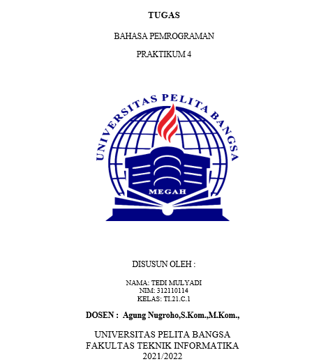
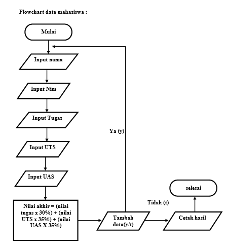
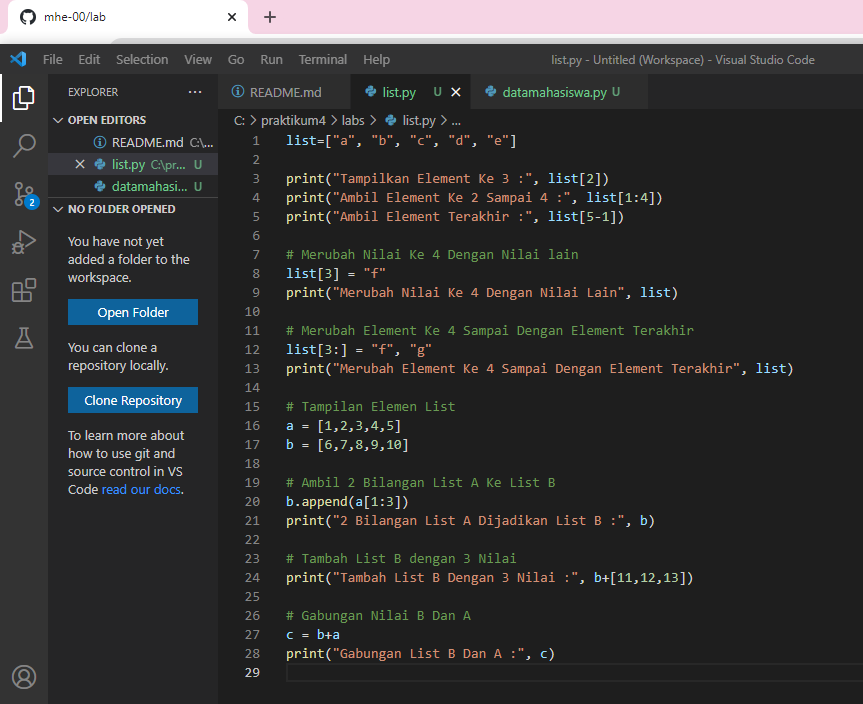
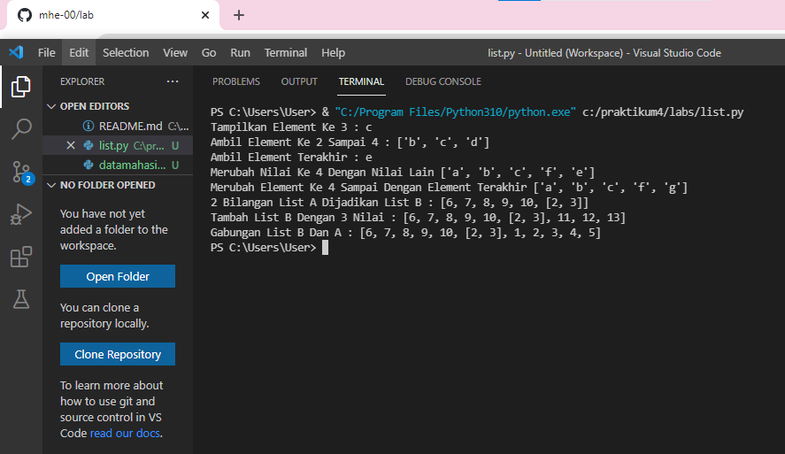
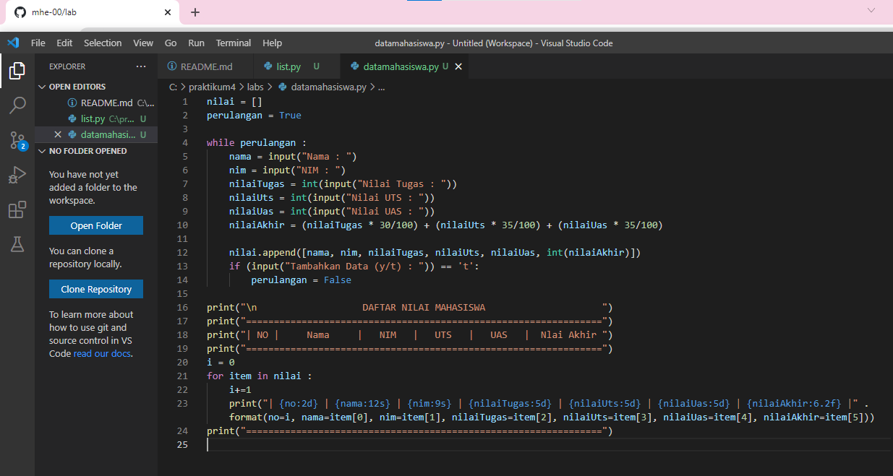
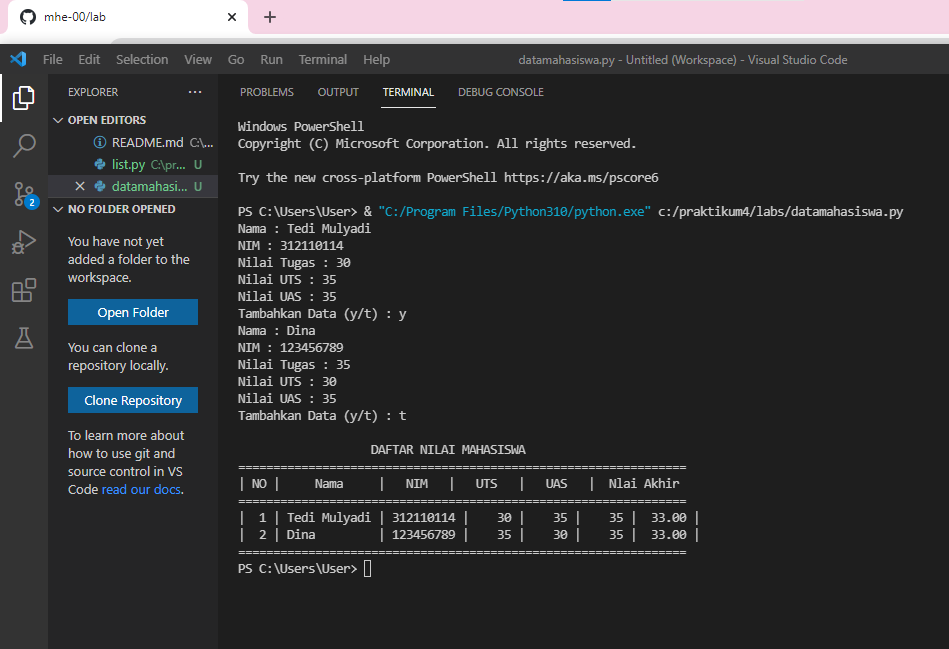

# lab4

# Flowchart data mahasiswa :

# Program list :

# Output program list :

# Input pada program ini adalah :

•	Input nama 
•	Input nim 
•	Input nilai tugas 
•	Input nilai uts
•	Input nilai uas
•	Input nilai akhir

Selain itu saya menngunakan perintah while untuk mengulang pertanyaan yang akan di input 

    nama = input("Nama : ")
    nim = input("NIM : ")
    nilaiTugas = int(input("Nilai Tugas : "))
    nilaiUts = int(input("Nilai UTS : "))
    nilaiUas = int(input("Nilai UAS : "))
    nilaiAkhir = (nilaiTugas * 30/100) + (nilaiUts * 35/100) + (nilaiUas * 35/100)

    nilai.append([nama, nim, nilaiTugas, nilaiUts, nilaiUas, int(nilaiAkhir)])
    if (input("Tambahkan Data (y/t) : ")) == 't':
        perulangan = False

maka outputnya akan ada pertanyaan tambah data jika jawab ‘Y’
pertanyaan akan terulang kembali dan di input kembali seperti sebelumnya, jika menjawab ‘T’ maka perintah selesai dan keluar output hasil inputan, dengan cara itu kita bisa menginput lebih dari 1 atau lebih sesuai yang kita inginkan.

# PROGRAMNYA :

# Outputnya akan seperti ini :

